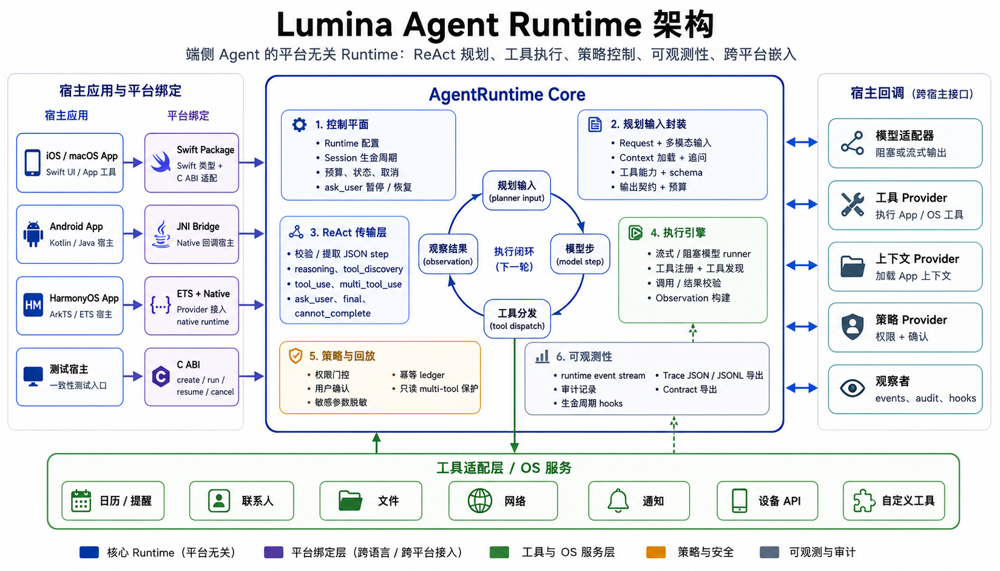

# Lumina Agent Runtime

Lumina Agent Runtime 是一个面向端侧 Agent 的 Runtime。它负责 ReAct 执行循环、工具注册与调度、权限检查、用户确认、审计记录、运行时事件，以及跨平台绑定。本仓库中的 app 是 Runtime 的承载示例，不是仓库的主体边界。



## Runtime 概览

Runtime 将模型输出转换为结构化 ReAct step，校验 step，按工具 schema 路由工具调用，并把工具结果整理成 observation 反馈给下一轮规划。宿主应用负责提供模型适配器和具体工具实现；Runtime 负责围绕这些能力建立稳定的执行契约。

核心职责：

- 根据用户请求、上下文、trace、预算和已注册工具 schema 组装 planner input。
- 消费 blocking 或 streaming model callback，生成标准 ReAct step。
- 在工具执行前校验参数、执行权限和确认策略。
- 将工具结果校验、脱敏、截断，并整理成 observation。
- 记录 audit、runtime events、hooks 和 trace，便于调试、评估与回放。
- 通过同一套 Runtime 契约接入 iOS、Android 和 HarmonyOS。

## Runtime 架构

`LuminaAgentRuntimeCore` 是平台无关的 C/C++ Runtime。它包含 session loop、planner input builder、ReAct transport、tool registry、tool executor、context/budget manager、trace recorder、audit/event callbacks、contract export，以及 status/cancellation 处理。Core loop 支持 reasoning、tool discovery、tool use、只读 multi-tool use、ask_user、final answer 和 cannot-complete 状态。

`LuminaAgentRuntimeApple` 是 Apple 平台 Swift binding。它将 Swift 原生的 request、tool、model、permission、confirmation、audit 和 event 类型适配到 Core Runtime 的 C ABI，同时保留 Swift 侧的 step generator、context compactor、progress sink 和 UI 回调能力。

Android 通过 JNI binding 把 Kotlin/Java host 对象连接到 Core Runtime。HarmonyOS 通过 ETS wrapper 和 native binding 暴露同一套 provider/callback 接口。

一次任务的执行流：

1. 宿主应用把 request 送入 Runtime session。
2. Runtime 从 request、context、tool schemas、trace 和 budget 组装 planner input。
3. Model adapter 返回结构化 ReAct step。
4. Runtime 校验 step，执行 permission / confirmation 策略，并调度工具调用。
5. 工具结果被校验、审计脱敏、按策略去重回放，并转换成 observation。
6. Observation 进入下一轮规划，直到 final answer、failure 或 cancellation。

## 三端开箱即用

### iOS

通过 Swift Package 引入 `LuminaAgentRuntime`，然后提供工具、step generator 和运行时策略对象。

```swift
let runtime = LuminaAgentRuntime(
    tools: tools.map(AnyLuminaAgentTool.init),
    stepGenerator: stepGenerator,
    configuration: configuration
)

for await event in runtime.runStream(request: request) {
    // 更新 UI、观察工具事件或收集运行状态。
}
```

### Android

通过 JNI binding 创建 native runtime，并把 callback 桥接回 Kotlin/Java host。Host 侧提供 model、tool、context、permission、confirmation、audit 和 event 方法。

```kotlin
val runtime = LuminaAgentRuntime(configurationJson, providers)
runtime.registerToolSchema(calendarSchemaJson)
val resultJson = runtime.run(requestJson)
runtime.cancel(requestId)
```

### HarmonyOS

通过 ETS wrapper 加载 native runtime，并用 `LuminaRuntimeProviders` 提供同一组 callback。

```ts
const runtime = new LuminaAgentRuntime(configurationJson, providers)
runtime.registerToolSchema(calendarSchemaJson)
const resultJson = runtime.run(requestJson)
runtime.close()
```

## Runtime 核心概念

- **Tool Schema**：描述工具名称、参数、副作用、敏感性、幂等策略和展示信息。
- **Tool Call / Tool Result**：Runtime 与宿主工具适配层之间的 JSON 契约。
- **ReAct Step**：模型生成的结构化动作、思考、提问或最终回答。
- **Permission & Confirmation**：决定工具调用可以直接执行、需要用户确认，还是必须拒绝。
- **Audit & Events**：暴露运行过程，用于调试、检查、benchmark 和信任链路展示。
- **Trace & Contracts**：支持导出执行 trace 和 Runtime contract，帮助跨端绑定保持一致。
- **Conformance Tests**：验证 Runtime contract 和平台绑定行为。

## Demo App

app 展示 Runtime 在真实界面中的一种承载方式，包括 chat、工具执行、权限与确认 UI、本地或远程推理设置、benchmark，以及可选的 trust/debug 页面。

接入 Runtime 不依赖这个 app。生产宿主可以直接使用 Runtime 包，并提供自己的工具、模型适配器、策略层和 UI。

## Setup & Run App

要求：

- 已安装 Xcode 的 macOS 环境。
- Swift Package 支持。
- 可运行 Mac Catalyst 的 destination。

用 Xcode 运行：

1. 打开 `app/Lumina.xcodeproj`。
2. 选择 `Lumina` scheme。
3. 选择 Mac Catalyst destination。
4. Build & Run。

命令行构建：

```bash
xcodebuild -project app/Lumina.xcodeproj \
  -scheme Lumina \
  -destination 'platform=macOS,variant=Mac Catalyst' \
  -configuration Debug build
```

运行 Runtime 测试：

```bash
swift test --package-path LuminaAgentRuntime
```

## 开发说明

- Runtime API 尽量保持平台无关。
- app 只作为验证 Runtime 行为的宿主。
- 通过共享 contract 和 conformance tests 保持三端绑定一致。
- 不要在 Runtime 代码中写入密钥、本机路径或 app 专属假设。
