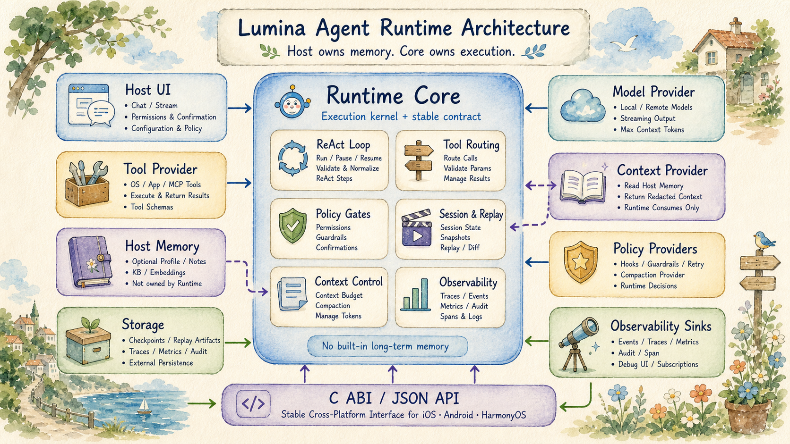

# Lumina Agent Runtime

Lumina Agent Runtime 是一个面向端侧 Agent 的 Runtime。它把模型输出、工具 schema、权限确认、上下文、审计、事件流和 session 状态组织成一套稳定的执行契约，让宿主应用可以在端侧运行可控、可观察、可恢复的 Agent。



## Runtime SDK

Runtime Core 是跨端的 C/C++ 执行核心。宿主提供模型、工具、上下文和 UI 策略；Runtime 负责把用户请求组织成 planner input，循环调用模型、校验 ReAct step、执行工具、写入 observation，并在 `result`、`cannot_complete`、失败、暂停或取消时结束。

Runtime canonical ReAct step 使用 `reasoning`、`tool_discovery`、`tool_use`、`multi_tool_use`、`ask_user`、`result`、`cannot_complete`。模型侧不输出 `result` 标签；最终回答是普通 assistant text，Runtime 在内部归一化为 `result`。旧 `final_answer` schema 不兼容。

## 核心能力

- **ReAct Loop**：解析 blocking 或 streaming model callback，并执行 dialect normalization、schema validation 和工具调度。
- **Tool Registry**：管理工具 schema、参数校验、副作用、权限确认、幂等策略和 external provider。
- **Deferred Tool Loading**：模型可通过 `tool_discovery` 按需加载完整工具 schema，避免首轮 prompt 过大。
- **Progressive Context Loading**：memory、文件、知识库和历史会话由宿主拥有，Runtime 只维护当前 session 的 loaded context。
- **Context Budget & Compaction**：按 provider/model context window 动态管理预算；宿主可替换 compaction provider。
- **Session / Checkpoint / Replay**：支持 session 状态、checkpoint、snapshot、cancel、resume 和 replay。
- **Hooks & Guardrails**：宿主可在请求、工具输入输出、result 输出前做拦截、确认、拒绝或暂停。
- **Observability**：event、trace、metrics、audit、span、snapshot 都是可选 sink，未注册时不强制持久化。

## 端侧接入

接入 Runtime 的核心是同一套 JSON contract 和 C ABI。iOS 可以直接使用 Swift Package；Android / HarmonyOS 通过 native binding 或 C ABI 接入 Core。

### iOS

通过 Swift Package 引入 `LuminaAgentRuntime`，并提供 model、tools、context、permission、confirmation，以及可选 hook、guardrail、observability、retry、context loading 和 tool loading provider。

运行测试：

```bash
swift test --package-path LuminaAgentRuntime
```

### Android

Android 侧使用 Runtime Core 的 CMake 构建，并打开 JNI binding：

```bash
cmake -S LuminaAgentRuntime -B build/android-arm64 \
  -DCMAKE_TOOLCHAIN_FILE=$ANDROID_NDK_HOME/build/cmake/android.toolchain.cmake \
  -DANDROID_ABI=arm64-v8a \
  -DANDROID_PLATFORM=android-26 \
  -DLUMINA_BUILD_ANDROID_JNI=ON \
  -DLUMINA_BUILD_LINUX_SAMPLE=OFF

cmake --build build/android-arm64
```

### HarmonyOS

HarmonyOS 侧通过 ETS wrapper 调用 native runtime。编译时把 Runtime Core 源码、`Runtime/include` 头文件，以及 `Bindings/HarmonyOS/native/lumina_runtime_harmony.cpp` 加入 native module，并链接 N-API。

## Model

模型、训练脚本和训练数据统一放在根目录 `model/` 下。App 运行时需要的模型副本通过脚本安装到 `app/Resources/Models/`，该目录不作为源码资产保存。

目录结构：

- `model/bundles/original/MiniCPMV46ReActModel/`：原始 MiniCPM-V 4.6 GGUF bundle，本地保留，不提交。
- `model/bundles/trained/MiniCPMV46ReActModel-AgenticSFTDPO-Q8/`：训练后的 Agentic SFT+DPO Q8 GGUF bundle，提交进 git。
- `model/embeddings/BGETextEmbedding/`：BGE embedding Core ML 模型和 tokenizer，本地保留，不提交。
- `model/training/code/agentic_rl/`：SFT/DPO 训练代码、配置和脚本。
- `model/training/data/TrainingData/`：训练和 holdout 数据，提交进 git。

统一模型脚本：

```bash
./model/lumina_model.sh download original
./model/lumina_model.sh download embedding
./model/lumina_model.sh download all
./model/lumina_model.sh pull-trained
./model/lumina_model.sh build-native-engine
./model/lumina_model.sh install original
./model/lumina_model.sh install trained
./model/lumina_model.sh install embedding
./model/lumina_model.sh install all
```

MiniCPM-V 4.6 的 GGUF 推理走 app 内的 C++ native engine，需要把
`app/NativeEngines/MiniCPMV46/LuminaMiniCPMV46GGUFEngine.cpp` 单独编译成
`libLuminaMiniCPMV46GGUFEngine.dylib`，并和 llama.cpp/ggml 依赖 dylib 一起放进模型 bundle。
这个编译入口已经合并到统一模型脚本：

```bash
./model/lumina_model.sh build-native-engine
```

`download original` 默认会在下载后构建 native engine；训练后的模型 bundle 已包含当前编译好的 dylib。
如果改过 C++ 推理代码、llama.cpp 依赖，或需要重新签名 dylib，重新运行 `build-native-engine`，再执行对应的 `install original` 或 `install trained`。

训练方式：

- Base model：MiniCPM-V 4.6。
- 流程：MiniCPM-V4.6 special-token/tool-call transport SFT -> holdout 检查 -> standard DPO -> LoRA 合并回 base model -> GGUF Q8 转换。
- LoRA 微调 language modules，冻结 vision / visual / projector / resampler。
- SFT train/test/evaluation：`50,844 / 6,351 / 6,351`。
- DPO train/test/evaluation：`41,126 / 5,139 / 5,139`。

## App

要求：

- 安装 Xcode。
- Swift Package 支持。

准备模型：

```bash
# 使用训练后的模型
./model/lumina_model.sh install trained

# 或使用原始模型
./model/lumina_model.sh install original

# 安装 embedding
./model/lumina_model.sh install embedding

# 一键安装已有本地资源
./model/lumina_model.sh install all
```

前置检查：

```bash
./scripts/check.sh
```

这个脚本会运行 Runtime SDK 和 App 的 Swift tests、文件命名检查，并执行一次 macOS Catalyst Debug build。需要清理构建产物时使用：

```bash
./scripts/clean_build_artifacts.sh
```

需要运行性能测试报告时使用：

```bash
./scripts/perf.sh
```

用 Xcode 运行：

1. 打开 `app/Lumina.xcodeproj`。
2. 选择 `Lumina` scheme。
3. 选择 Mac Catalyst、已连接的 iPhone 或 iPad。
4. Build & Run。

命令行构建 macOS Catalyst：

```bash
xcodebuild -project app/Lumina.xcodeproj \
  -scheme Lumina \
  -destination 'platform=macOS,variant=Mac Catalyst' \
  -configuration Debug build
```

命令行构建真机版本：

```bash
xcodebuild -project app/Lumina.xcodeproj \
  -scheme Lumina \
  -destination 'generic/platform=iOS' \
  -configuration Debug build
```
