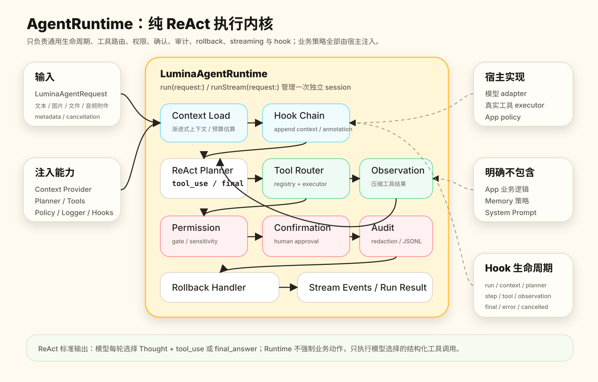
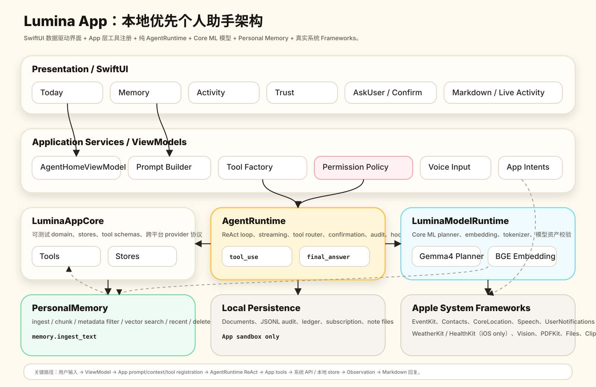

# Lumina

Lumina 是一个本地优先的 iOS 个人助手工程。它把端侧模型、ReAct agent runtime、App tools、Personal Memory 和 SwiftUI 体验拆成独立模块：模型负责理解和生成结构化 ReAct 步骤，`AgentRuntime` 只负责通用执行循环，真正的日历、提醒、文件、通讯录、位置、健康、天气等动作由 App 层注册的真实工具完成。

工程目标不是做一个只能演示模型的 toy app，而是把“用户输入 -> agent 自主模型 -> 工具执行 -> 权限确认 -> 可读 Markdown 回复 -> 审计记录”做成完整闭环。敏感数据默认留在本地；需要副作用的动作会先经过 Lumina 自定义确认，再触发系统权限或系统界面。

## 架构

### AgentRuntime

`AgentRuntime` 是纯 runtime framework。它不包含 App 业务逻辑、不内置 memory 策略、不写 system prompt，也不绑定具体模型实现。App 或其它宿主通过 request、context provider、step generator、tool registry、permission gate、confirmation coordinator、audit logger 和 hooks 注入能力。



一次任务是一个独立 run session。Runtime 加载上下文后，把当前 request、可用工具 schema、历史 observation 和 context section 交给 ReAct step generator。Step generator 可以返回 `tool_use` 或 `final_answer`；runtime 对工具调用执行权限检查、确认、路由、审计、observation 压缩和 streaming event 输出。接近上下文预算时，runtime 会通过可注入 compactor 做压缩。

### Lumina App

Lumina App 是 runtime 的宿主。App 层负责 system prompt、工具注册、模型 bootstrap、真实系统 API adapter、权限文案、SwiftUI 状态管理和最终 Markdown 渲染。



App 的输入层支持文本、附件和语音转写；ViewModel 把请求交给 App Services 组装 prompt、context 和 tool list。`LuminaModelRuntime` 提供 MiniMind-o ReAct model 与 BGE embedding 的 Core ML 接入，`PersonalMemory` 提供本地检索和持久化，`LuminaMarkdownUI` 负责完整 Markdown AST 渲染。工具执行结果会以用户可读摘要回到 ReAct loop，并最终渲染成 Markdown。

## 工程组成

- `AgentRuntime`：通用 ReAct runtime，包含 run/stream、tool router、permission gate、confirmation、audit、rollback、hooks、context compaction。
- `PersonalMemory`：本地 memory store，负责 ingest、chunk、metadata filter、embedding search、recent/stat/delete 等存储和检索能力。
- `LuminaModelRuntime`：模型工程层，负责 MiniMind-o Core ML ReAct model、BGE embedding、tokenizer、模型资产校验和推理 adapter。
- `LuminaMarkdownUI`：基于 Swift Markdown 的完整 Markdown 解析与 SwiftUI 渲染组件。
- `LuminaAppCore`：可测试的 App domain、stores、tool schemas、App-local tool executor 和跨平台 provider 协议。
- `Lumina`：主 iOS / Mac Catalyst App，包含 SwiftUI views、ViewModels、真实 iOS framework adapter、App Intents、语音输入和确认浮层。
- `LuminaWidgets`：Live Activity / Widget 扩展，用于展示进行中的任务状态和完成入口。

## 环境要求

- macOS 26 或更新版本。
- Xcode 26.5 或更新版本，安装 iOS 26 SDK。
- Swift 6.2 toolchain。
- 已安装 Xcode command line tools：`xcode-select --install`。
- 可选：Hugging Face CLI `hf`，用于刷新本地模型资产。

## 快速开始

克隆后进入工程根目录：

```bash
cd Lumina
```

安装或刷新模型资产：

```bash
bash scripts/setup_models.sh
```

打开 Xcode 工程：

```bash
open Lumina.xcodeproj
```

在 Xcode 顶部选择 `Lumina` scheme，然后选择一台 iPhone 真机、iOS Simulator 或 `My Mac (Designed for iPad)` / Mac Catalyst destination 运行。

如果只想先验证 SwiftPM targets：

```bash
swift test
```

如果要做一次本地完整检查：

```bash
bash scripts/check.sh
```

## 模型配置

Lumina 默认把模型作为 App bundle 资源内置，不在运行时要求用户下载。

开发脚本：

```bash
python3 -m venv .venv-minimindo
.venv-minimindo/bin/python -m pip install coremltools torch transformers huggingface_hub accelerate 'numpy<2'
PYTHON_BIN=.venv-minimindo/bin/python LUMINA_BUILD_MINIMINDO_COREML=1 bash scripts/setup_models.sh
```

脚本会下载并配置：

- MiniMind-o ReAct model：`Resources/Models/MiniMindOReActModel/`
- BGE embedding：`Resources/Models/BGETextEmbedding.mlmodelc`
- BGE tokenizer：`Resources/Models/BGETextEmbedding-tokenizer.json`

默认 MiniMind-o context length 是 `12000`。`scripts/build_minimindo_coreml.sh` 会下载官方 `jingyaogong/minimind-3o` 权重并转换 text Thinker ReAct decoder；转换图包含 Core ML `MLState` KV cache、Conv2d 线性层、ANE/MPS 友好的 RMSNorm/softmax 和 in-graph argmax。脚本会调用 `scripts/validate_minimindo_bundle.py` 校验模型配置和上下文长度。模型资产体积较大，已经通过 `.gitignore` 排除，不应提交到仓库。

开发时可以用环境变量覆盖模型查找路径：

```bash
export LUMINA_MINIMINDO_MODEL=/absolute/path/MiniMindOReActModel
export LUMINA_EMBEDDING_MODEL=/absolute/path/BGETextEmbedding.mlmodelc
export LUMINA_EMBEDDING_TOKENIZER=/absolute/path/BGETextEmbedding-tokenizer.json
```

## 构建命令

SwiftPM 测试：

```bash
swift test
```

列出 Xcode schemes：

```bash
xcodebuild -project Lumina.xcodeproj -list
```

单独编译 frameworks：

```bash
xcodebuild -project Lumina.xcodeproj -scheme AgentRuntime -destination 'platform=macOS,variant=Mac Catalyst' build
xcodebuild -project Lumina.xcodeproj -scheme PersonalMemory -destination 'platform=macOS,variant=Mac Catalyst' build
xcodebuild -project Lumina.xcodeproj -scheme LuminaModelRuntime -destination 'platform=macOS,variant=Mac Catalyst' build
xcodebuild -project Lumina.xcodeproj -scheme LuminaMarkdownUI -destination 'platform=macOS,variant=Mac Catalyst' build
xcodebuild -project Lumina.xcodeproj -scheme LuminaAppCore -destination 'platform=macOS,variant=Mac Catalyst' build
```

编译完整 Mac Catalyst App：

```bash
xcodebuild -project Lumina.xcodeproj \
  -scheme Lumina \
  -destination 'platform=macOS,variant=Mac Catalyst' \
  CODE_SIGNING_ALLOWED=NO \
  build
```

编译完整 iPhone 真机 App：

```bash
xcodebuild -project Lumina.xcodeproj \
  -scheme Lumina \
  -destination 'platform=iOS,id=<DEVICE_ID>' \
  -configuration Debug \
  build
```

## App 能力

Lumina 的工具由 App/AppCore 注册到 runtime。Runtime 每一轮 ReAct 都会看到压缩后的可用 tool schema，并由模型自主决定是否调用工具或直接给最终回答。

当前 App 能力包括：

- 时间与设备状态：当前时间、电量、热状态、网络状态、存储状态。
- 日历与提醒：查询、创建、更新、完成、删除、可用性检查。
- 通讯录与通信动作：联系人查询/创建/更新、短信草稿、邮件草稿、电话/FaceTime 入口。
- 位置、地图与通知：当前位置、地图搜索/路线、本地通知。
- 文件与内容处理：保存/读取/更新/删除 Markdown note，网页正文获取，PDF/文本读取，图片 OCR 和 metadata。
- Personal Memory：本地检索、recent、stats、删除，以及由 agent 自主调用的 `memory.ingest_text`。
- 记账与订阅：本地交易记录、查询、更新、删除，内容源订阅、刷新和移除。
- 天气与健康：iOS 真机上的 WeatherKit 天气摘要，HealthKit 只读健康摘要和少量样本查询；Mac Catalyst 默认不注册这类工具。
- 输入输出体验：文本、附件、端侧语音转写、streaming 状态、Markdown 回复、确认浮层、Live Activity 和完成通知。

## 隐私与安全

- 本地优先：Personal Memory、ledger、subscription、audit log 等数据保存在本地。
- Runtime 纯粹：`AgentRuntime` 不知道 App 业务、不读取 memory、不保存用户资料。
- 工具确认：有副作用工具必须先经过 Lumina 确认，再执行系统动作。
- 系统权限：日历、提醒、通讯录、定位、语音、健康等权限由真实系统 API 触发。
- 审计日志：每次 tool call 都写入审计记录，敏感字段会脱敏。
- Agentic memory：长期记忆只能由模型在 ReAct 中主动选择调用 `memory.ingest_text` 写入；App permission policy 决定是否需要额外确认。
- 高敏数据：健康、位置、通讯、剪贴板、文档正文等内容按敏感数据处理，避免大量原始隐私上下文进入 prompt。

## 常见问题

### 打开工程应该用哪个文件？

使用 Xcode 打开根目录下的 `Lumina.xcodeproj`：

```bash
open Lumina.xcodeproj
```

SwiftPM 的 `Package.swift` 用于 framework 和测试；完整 App、Widget、签名、资源嵌入和 capabilities 由 Xcode project 管理。

### 新增文件或 target 应该怎么维护？

`Lumina.xcodeproj` 是主工程源文件。新增 Swift 文件、资源、framework target 或 build phase 时，优先通过 Xcode 的 Project Navigator / Target Membership / Build Phases 维护，提交 `Lumina.xcodeproj/project.pbxproj` 的真实变更。

`Package.swift` 只负责 SwiftPM library/test targets，方便在命令行跑 framework 单测；不要把它当作完整 App 工程的替代品。

### 找不到模型或模型不可用怎么办？

先运行：

```bash
bash scripts/setup_models.sh
```

确认 `Resources/Models/` 下存在 `MiniMindOReActModel/`、`BGETextEmbedding.mlmodelc` 和 `BGETextEmbedding-tokenizer.json`。如果只想验证非模型路径，测试会在未设置模型环境变量时跳过真实模型用例。

### 真机安装失败，提示签名或 profile 问题怎么办？

确认 Xcode 中 `Lumina` target 的 Team 是可用开发者账号，并且 bundle id `dev.local.Lumina.test.gsc` 可以签名。命令行构建真机 App 时不要加 `CODE_SIGNING_ALLOWED=NO`，这个参数只适合本地 Catalyst 编译验证。

### Mac Catalyst 和 iPhone 真机能力有什么差异？

大部分 App-local tools、文件、剪贴板、网络、Markdown、模型和 memory 能在 Mac Catalyst 上验证。WeatherKit 和 HealthKit 在本工程中按 iOS-only capability 处理，Mac Catalyst 默认不携带对应 entitlements，也不注册 `weather.*` / `health.*` 工具。其它部分系统能力也依赖 iOS 真机权限或硬件，例如电话入口、短信草稿、Live Activity 展示和真实定位体验。平台不支持时，tool 应返回结构化不可用原因，而不是伪造结果。

### 为什么不是直接把业务写进 AgentRuntime？

为了让 runtime 可复用、可测试、可移植。`AgentRuntime` 只定义通用 ReAct、tool、permission、confirmation、audit、hook 和 streaming 机制；Lumina App 负责注入 system prompt、工具、模型和平台策略。这样同一个 runtime 可以被其它 App 或 framework 宿主复用。
